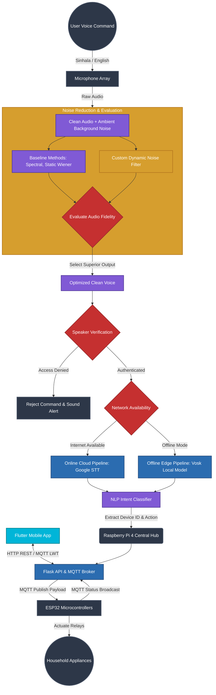

# System Architecture & Design Approach Flowchart

Here is the fully accurate architectural flowchart representing your entire system. It includes the new analytical noise reduction pipeline, the hybrid biometric security, the dual online/offline routing, and the Flutter/ESP32 hardware integration.

> [!TIP]
> **How to use this in your thesis:**
> This diagram is rendered automatically. You can right-click on the flowchart above and select **"Copy image"** or take a screenshot, and place it directly into your Microsoft Word document under the *System Flow Chart* or *Design Approach* section!
