# System Block Diagram

This block diagram represents the high-level functional modules and hardware layers of the KHomeAuto project. Unlike the flowchart (which shows process logic), this block diagram is designed to show the structural hierarchy of the system, which is standard for the "System Architecture" section of a PhD-level thesis.

```mermaid
graph LR
    classDef layer fill:#f7fafc,stroke:#2d3748,stroke-width:3px,color:#1a202c,stroke-dasharray: 5 5;
    classDef software fill:#2b6cb0,stroke:#1a365d,stroke-width:2px,color:#fff;
    classDef hardware fill:#c53030,stroke:#742a2a,stroke-width:2px,color:#fff;

    %% Define the Layers
    subgraph Layer1 [1. User Input Layer]
        direction TB
        Mic[Omnidirectional Microphone Array]:::hardware
        App[Flutter Mobile Application]:::software
    end

    subgraph Layer2 [2. Edge Compute Layer Raspberry Pi 4]
        direction TB
        NR[Analytical Noise Reduction Engine]:::software
        BIO[Hybrid Speaker Biometrics Model]:::software
        ASR[Dual Architecture ASR Engine]:::software
        NLP[Sinhala Intent Classifier]:::software
        
        NR --> BIO --> ASR --> NLP
    end

    subgraph Layer3 [3. Network & Integration Layer]
        direction TB
        API[Flask REST API Gateway]:::software
        MQTT[Mosquitto MQTT Broker]:::software
    end

    subgraph Layer4 [4. Physical IoT Layer]
        direction TB
        ESP[ESP32 Microcontroller Node]:::hardware
        Relay[Multi-Channel Relay Module]:::hardware
        Load[Electrical Appliances]:::hardware
        
        ESP --> Relay --> Load
    end

    %% Inter-layer Routing
    Mic -- "Raw Audio Input" --> NR
    App -- "HTTP Registration" --> API
    App -. "Real-Time Telemetry" .- MQTT
    
    NLP -- "Classified Command" --> API
    API -- "Publish JSON" --> MQTT
    
    MQTT -- "Subscribed Topic" --> ESP
    ESP -. "LWT Status Update" .- MQTT

    %% Apply CSS class to subgraphs to make them look like block bounds
    class Layer1,Layer2,Layer3,Layer4 layer;
```

> [!TIP]
> **How to use this in your thesis:**
> This block diagram is strictly categorized into 4 physical/logical layers (Input, Compute, Network, IoT). Right-click on the rendered image above, select **"Copy image"**, and paste it into your thesis directly under the **General System Block Diagram** heading (Section 3.1.2).
