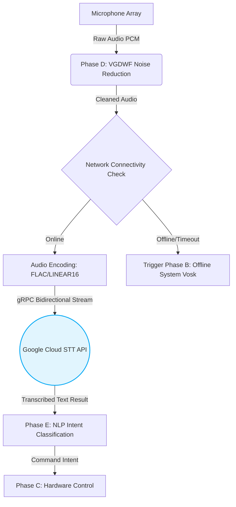

# Phase A: Cloud-Based Online Speech Recognition System

## 1. Overview and Architectural Rationale
The Online System (Phase A) constitutes the primary transcription engine for the home automation environment under optimal network conditions. It leverages cloud-based Automatic Speech Recognition (ASR), specifically the **Google Cloud Speech-to-Text (STT) API**, to achieve state-of-the-art transcription accuracy. 

The rationale for prioritizing a cloud-based approach is rooted in the availability of deep neural network (DNN) acoustic models and massive language models that are computationally prohibitive to run directly on edge devices like the Raspberry Pi 4. This phase is designed to handle complex, unconstrained vocabulary, diverse speaker accents, and contextual nuances with minimal Word Error Rate (WER).

## 2. System Architecture and Data Flow
The architecture of Phase A is designed as a client-server distributed system. The Raspberry Pi acts as the edge client responsible for audio acquisition, local pre-processing, and secure transmission, while the Google Cloud infrastructure acts as the processing backend.

*Figure 1: Architectural Data Flow of the Online ASR System.*

## 3. Implementation Details and API Integration

### 3.1 Audio Pre-processing and Payload Optimization
Before transmission, the raw audio captured from the domestic environment is subjected to the custom **Voice Activity Detection-Guided Dynamic Wiener Filter (VGDWF)**. This step is critical; transmitting highly noisy audio not only increases cloud processing time but also severely degrades the ASR confidence score. Post-filtering, the audio is encoded into a lossless format (e.g., `LINEAR16` at a 16kHz sampling rate) to minimize payload size while preserving the high-fidelity acoustic features necessary for the cloud's acoustic model.

### 3.2 Streaming Recognition (gRPC)
To achieve natural interaction speeds, the implementation utilizes **Streaming Recognition** via gRPC rather than synchronous REST requests. 
* **Latency Reduction:** Streaming allows the Raspberry Pi to send audio chunks continuously as the user speaks. The Cloud STT engine processes these chunks and returns interim results in real-time, significantly reducing the perceived latency between the user's spoken command and the physical hardware execution.
* **Endpointing:** The system utilizes the API's built-in endpointing capabilities, augmented by the local VAD, to accurately determine the end of an utterance. This automatically closes the stream and finalizes the transcription without requiring a manual "stop listening" button.

### 3.3 Security and Authentication
Communication between the edge node and the cloud is secured via **TLS (Transport Layer Security)**. Authentication is handled via Service Account JSON keys provisioned through Google Cloud IAM, ensuring that the smart home system's domestic data stream is strictly authenticated and encrypted against interception.

## 4. Performance Metrics and Network Dependency

While Phase A offers superior accuracy, its primary constraint is its dependency on internet connectivity and network latency.

* **Transcription Accuracy:** As demonstrated in the comparative analysis, under stationary and non-stationary noise conditions (after VGDWF filtering), the online system achieves an average control accuracy of **88.8%**, heavily outperforming edge-only baselines.
* **Latency Overhead:** The round-trip time (RTT) for a typical 2-second command is approximately 400-800ms, heavily dependent on the local ISP routing and proximity to the Google Cloud data center.
* **Failover Strategy (High Availability):** A critical component of Phase A's implementation is its robust timeout handling. If the API fails to establish a connection within a threshold of 1000ms, or if a socket error occurs, the system gracefully aborts Phase A and seamlessly falls back to the Offline System (Phase B) to ensure uninterrupted home automation control.

## 5. System Execution and Visual Validation

> [!NOTE] 
> **Screenshot Placeholder 1: Terminal Execution**
> *(Insert a screenshot here showing the Raspberry Pi terminal successfully running the Python script. The terminal should show the audio being captured, the "Connecting to Google Cloud..." status, and the successful transcribed return text, e.g., `[Online ASR] Recognized: "turn on the living room lights"`)*

> [!NOTE] 
> **Screenshot Placeholder 2: Cloud Console Metrics**
> *(Insert a screenshot of your Google Cloud Console "APIs & Services" dashboard. Highlight the Speech-to-Text API traffic graph, showing the spike in requests to validate that the hardware is successfully pinging the cloud server.)*
