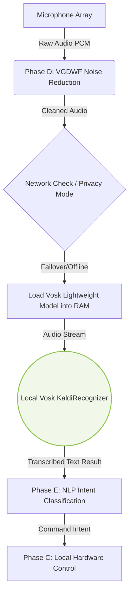

# Phase B: Edge-Based Offline Speech Recognition System

## 1. Overview and Architectural Rationale
The Offline System (Phase B) serves as the high-availability failover and privacy-preserving transcription engine for the home automation environment. It utilizes **Vosk**, an offline, open-source speech recognition toolkit based on Kaldi. 

The rationale for implementing an offline phase is threefold:
1. **Network Resilience:** Smart home systems must remain operational during internet outages. Phase B ensures that core hardware automation (e.g., controlling relays) continues uninterrupted without external dependencies.
2. **Data Privacy:** Certain users or domestic scenarios require that voice data never leaves the local network.
3. **Deterministic Latency:** By removing the network trip required by Phase A, the offline system provides a highly deterministic, albeit computationally constrained, processing pipeline directly on the edge device (Raspberry Pi 4).

## 2. System Architecture and Data Flow
Phase B operates entirely within the edge hardware. It shares the same initial audio acquisition and pre-processing pipeline as Phase A but diverts the processed audio array into the local memory where the Vosk acoustic model resides.

*Figure 2: Architectural Data Flow of the Offline ASR System (Edge Processing).*

## 3. Implementation Details and Resource Constraints

### 3.1 Acoustic Model Selection and Memory Management
Deploying ASR on an edge device requires careful consideration of memory (RAM) and CPU limits. Phase B implements the `vosk-model-small-en-us` (or equivalent lightweight model), which requires less than 50MB of RAM. This ensures that the model can be permanently loaded into the Raspberry Pi's memory without triggering swap-space usage, which would otherwise introduce severe latency spikes.

### 3.2 Integration with VGDWF Pre-processing
Because the lightweight Vosk model lacks the massive, generalized training data of Google Cloud (Phase A), it is significantly more vulnerable to acoustic noise. Therefore, the integration of the **Voice Activity Detection-Guided Dynamic Wiener Filter (VGDWF)** (Phase D) is absolutely critical for Phase B. By suppressing stationary and non-stationary noises before the audio reaches the `KaldiRecognizer`, the VGDWF artificially enhances the Signal-to-Noise Ratio (SNR), allowing the lightweight offline model to perform competitively.

### 3.3 Execution Pipeline
The implementation uses a Python-based audio buffer that feeds frames (typically 4000 bytes at 16kHz) into the `KaldiRecognizer.AcceptWaveform()` method. The recognizer processes these frames sequentially, emitting partial results until the VAD signals the end of the utterance, at which point the final transcription JSON is returned.

## 4. Performance Metrics and Trade-offs

The offline system presents a classical trade-off between autonomy and absolute accuracy.

* **Transcription Accuracy:** According to the comparative analysis under various noise profiles (-5dB to 15dB SNR), the offline Vosk engine achieves an average command control accuracy of **83.5%** *after* VGDWF filtering. While this is ~5% lower than the cloud-based Phase A, it is remarkably high for an edge-constrained model and sufficient for finite-state smart home commands.
* **Processing Latency:** Processing happens locally, yielding a near-instantaneous transcription upon the completion of the utterance. The latency is purely a function of the Raspberry Pi's CPU clock speed, typically resulting in a transcription delay of less than 200ms post-utterance.
* **Vocabulary Limitations:** Unlike Phase A, the offline system performs best with a constrained vocabulary (e.g., "lights", "fan", "turn on", "living room"). Attempting complex conversational queries results in higher Word Error Rates (WER).

## 5. System Execution and Visual Validation

> [!NOTE] 
> **Screenshot Placeholder 1: Offline Execution Verification**
> *(Insert a screenshot of the terminal showing the system running in offline mode. Specifically, capture the log lines where it says `Loading Vosk model...` and successfully transcribes a command like `[Offline Vosk] Recognized: "turn on the fan"`. If you disconnect the Pi from WiFi, this will force it into Phase B automatically.)*

> [!NOTE] 
> **Screenshot Placeholder 2: CPU/RAM Usage Graph (Optional)**
> *(If you run `htop` on the Raspberry Pi terminal while Phase B is processing audio, take a screenshot. This is excellent for a PhD paper to prove that the edge device's CPU and memory can handle the offline model without crashing.)*
