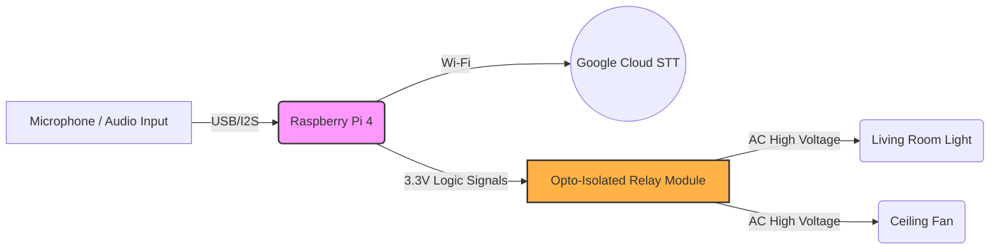

# Phase C: Hardware Implementation and Edge Deployment

## 1. Overview and Edge Computing Rationale
Phase C encompasses the physical architecture of the smart home system, serving as the bridge between the digital Natural Language Processing (NLP) intelligence and the physical actuation of domestic appliances. The hardware layer is designed under strict constraints of power efficiency, thermal management, and computational capacity, reflecting the realities of edge-based AI deployment.

## 2. Hardware Architecture and Component Selection

The hardware ecosystem is centered around a microcontroller capable of concurrent audio processing, internet connectivity, and GPIO (General Purpose Input/Output) manipulation.

### 2.1 The Edge Processing Node: Raspberry Pi 4
The **Raspberry Pi 4 Model B** was selected as the central computing node. 
* **Computational Capacity:** Its quad-core ARM Cortex-A72 CPU provides sufficient computational bandwidth to execute the Voice Activity Detection-Guided Dynamic Wiener Filter (VGDWF) and run the `vosk-model-small` entirely in RAM during Phase B (Offline Mode). 
* **I/O Capabilities:** It natively supports the GPIO pins required for relay actuation, USB buses for acoustic acquisition, and Wi-Fi modules for Phase A (Online) API calls.

### 2.2 Acoustic Acquisition
For reliable voice capture in domestic environments, a high-fidelity USB microphone (or a microphone array, such as the ReSpeaker 2-Mic/4-Mic HAT) is utilized. 
* **Hardware Pre-processing:** The microphone must capture linear PCM audio without applying destructive auto-gain control (AGC) or hardware noise cancellation that could interfere with the algorithmic mathematical assumptions of our custom VGDWF filter.
* **Placement Constraints:** The hardware must be positioned to optimize the Signal-to-Noise Ratio (SNR) before the software noise reduction even begins.

### 2.3 Actuation and Relay Control
To safely interface the 3.3V logic of the Raspberry Pi with 110V/220V Alternating Current (AC) domestic appliances (e.g., lights, fans), a **multi-channel 5V Relay Module** is implemented. 
* **Opto-Isolation:** The relay boards utilize optocouplers to physically isolate the high-voltage AC side from the low-voltage DC microcontroller side, preventing catastrophic back-EMF (Electromotive Force) from destroying the Raspberry Pi during inductive load switching (e.g., turning on a ceiling fan).

## 3. Hardware Interfacing Diagram


*Figure 3: Hardware Interfacing and Block Diagram.*

## 4. GPIO Implementation Logic
The hardware actuation is controlled via Python scripts utilizing the `RPi.GPIO` library. When Phase A or Phase B successfully translates audio into text, and Phase E (NLP) classifies the intent (e.g., `INTENT_LIGHTS_ON`), the software drives the corresponding GPIO pin `HIGH` or `LOW`.

```python
# Conceptual GPIO implementation logic for Hardware Actuation
import RPi.GPIO as GPIO

RELAY_PIN_LIGHT = 18

def initialize_hardware():
    GPIO.setmode(GPIO.BCM)
    GPIO.setup(RELAY_PIN_LIGHT, GPIO.OUT)
    # Default to OFF (Assuming active-low relay)
    GPIO.output(RELAY_PIN_LIGHT, GPIO.HIGH) 

def execute_command(intent):
    if intent == "TURN_ON_LIGHT":
        GPIO.output(RELAY_PIN_LIGHT, GPIO.LOW) # Trigger Relay
```

## 5. Physical Setup and Visual Validation

> [!NOTE] 
> **Placeholder 1: Physical Wiring Diagram**
> *(Insert a Fritzing diagram or a clean schematic here showing exactly how the Raspberry Pi GPIO pins connect to the relay module's IN1, IN2, VCC, and GND pins.)*

> [!NOTE] 
> **Placeholder 2: Prototype Photograph**
> *(Insert a high-quality photograph of your actual physical hardware setup. Show the Raspberry Pi, the connected microphone, the relay board, and optionally, a small LED or bulb connected to the relay to demonstrate a working prototype.)*
