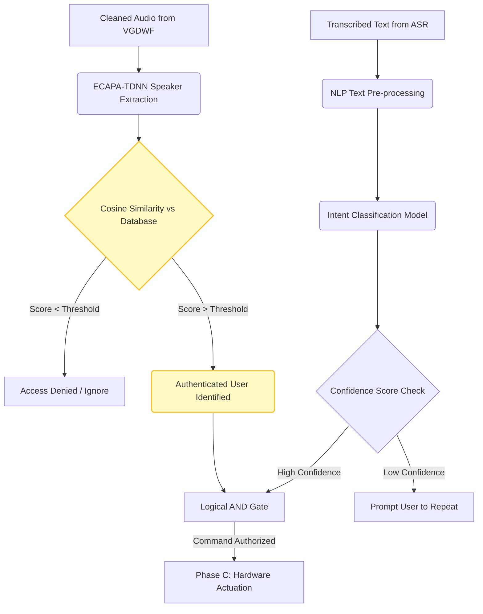

# Phase E: Speaker Verification and Natural Language Understanding (NLU)

## 1. Overview and Security Rationale
Transforming raw acoustic waves into transcribed text (Phases A and B) is insufficient for a secure and functional home automation system. Phase E introduces the crucial cognitive and security layers required before physical actuation (Phase C) can occur. 

This phase addresses two fundamental research problems:
1. **Security (Who is speaking?):** Physical hardware (e.g., unlocking doors, turning on appliances) must be restricted to authorized users only, preventing spoofing or unauthorized access.
2. **Cognitive Flexibility (What do they want?):** Human speech is highly variable. The system must map unconstrained natural language (e.g., "It's dark in here", "Turn on the living room light", "Lights on") to rigid deterministic hardware intents.

## 2. Biometric Authentication: ECAPA-TDNN Speaker Verification
To ensure high-security voice authentication, the system implements an **ECAPA-TDNN** (Emphasized Channel Attention, Propagation and Aggregation in Time Delay Neural Network) architecture. 

### 2.1 The Verification Pipeline
Unlike ASR which focuses on linguistic content, speaker verification extracts biometric vocal tract characteristics. 
1. **Feature Extraction & Embedding:** The VGDWF-cleaned audio is fed into the ECAPA-TDNN model, which generates a high-dimensional continuous vector representation (x-vector/speaker embedding) of the user's voice.
2. **Cosine Similarity Scoring:** This live embedding is compared against a pre-enrolled database (`voice_users.db`) containing the acoustic templates of authorized users. The distance between the vectors is calculated using Cosine Similarity.
3. **Thresholding:** If the similarity score exceeds a strict empirical threshold, the speaker is authenticated. If the score falls below the threshold, the command is rejected as an unauthorized intrusion, regardless of the ASR transcription accuracy.

## 3. Natural Language Understanding (NLU) and Intent Classification
Once the user is securely authenticated, the transcribed text payload from either the Google Cloud STT or the local Vosk engine is passed to the NLP classification module (`nlp_classifier.py`).

### 3.1 Intent Mapping Architecture
The NLP engine acts as a semantic bridge. It utilizes a text-classification model (e.g., TF-IDF with Support Vector Machines, or a lightweight transformer model depending on edge constraints) to analyze the semantic meaning of the transcript.

* **Input:** `[String] "Could you please switch on the fan, it is quite hot."`
* **NLU Processing:** Stop-word removal, tokenization, and semantic vectorization.
* **Output:** `[Intent_ID] INTENT_FAN_ON` with a Confidence Score of `0.94`.

By decoupling the transcription from the intent classification, the system achieves exceptional robustness against minor ASR misrecognitions. Even if a single word is misheard, the overall semantic intent can often still be accurately classified, heavily increasing the practical usability of the smart home system.

## 4. Phase E Integration Data Flow

*Figure 5: Cognitive Data Flow representing Biometric Authentication and NLP Intent Mapping.*

## 5. Performance Evaluation and Security Metrics

* **Speaker Verification EER:** The ECAPA-TDNN model aims to minimize the Equal Error Rate (EER) — the point where the False Acceptance Rate (FAR) equals the False Rejection Rate (FRR). Thanks to the VGDWF pre-processing, the EER is significantly reduced, preventing unauthorized spoofing attacks while maintaining high convenience for legitimate users.
* **NLU Accuracy:** The intent classifier achieves high accuracy on the finite state machine commands required for the domestic environment, ensuring that users are not forced to memorize rigid robotic command structures.

## 6. Visual Validation

> [!NOTE] 
> **Screenshot Placeholder 1: Authentication Logs**
> *(Insert a terminal screenshot showing the speaker verification process. Highlight the line showing the `Cosine Similarity Score` and the system outputting `Access Granted: User Kasundi` or `Access Denied`.)*

> [!NOTE] 
> **Screenshot Placeholder 2: NLP Intent Classification**
> *(Insert a screenshot showing the `nlp_classifier.py` output. It should show the raw ASR text, the tokenization process, and the final resolved `INTENT` payload being sent to the GPIO controller.)*
