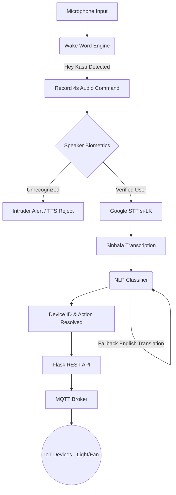

# Project Report: Kasundi AI Voice Assistant (Sinhala)

## 1. Executive Summary

The **Kasundi AI Voice Assistant** is a smart home voice control system specifically designed to understand and execute commands in **Sinhala**. Unlike traditional voice assistants, this project incorporates advanced **Voice Biometrics** for security, ensuring that only registered users can control the connected IoT devices. The system bridges state-of-the-art Speech-to-Text (STT) capabilities with a robust Flask and MQTT backend for real-time home automation.

## 2. Key Features

- **Sinhala Language Support**: Native understanding of Sinhala commands using Google Web Speech API (`si-LK`).
- **Voice Biometrics (Speaker Verification)**: Analyzes the vocal tract shape (using MFCC features) to verify the speaker's identity before executing commands, effectively rejecting unauthorized users.
- **Wake Word Detection**: An edge-friendly continuous listening module designed to activate the system upon hearing "Hey Kasu" (currently optimized for TFLite edge deployments).
- **Natural Language Intent Matching**: Classifies transcribed Sinhala phrases (e.g., "ලයිට් දාන්න" - Turn on the light) into actionable device IDs and commands.
- **IoT Integration**: Communicates with smart home hardware via a REST API and MQTT messaging broker.
- **Auditory Feedback**: Provides real-time text-to-speech (TTS) feedback to the user acknowledging commands and security alerts.

## 3. System Architecture

The project is modularized into several core Python components working in tandem:

### 3.1. Core Components

*   **`main_production.py`**: The central nervous system of the project. It orchestrates the continuous listening loop, coordinates the biometric checks, triggers the STT engine, and forwards the resolved commands to the server.
*   **`speaker_biometrics.py`**: Uses `librosa` to extract Mel-frequency cepstral coefficients (MFCCs). It drops the 0th coefficient (volume/energy) to focus purely on the physiological shape of the voice. Uses **Cosine Similarity** (threshold 80%) against an SQLite database to verify the speaker.
*   **`nlp_classifier.py`**: Parses the Sinhala text to extract the `device_id` (e.g., `light_1`, `fan_1`) and `action` (e.g., `ON`, `OFF`). It utilizes `deep_translator` as a fallback to translate Sinhala to English for robust matching.
*   **`wakeword_engine.py`**: Designed to run a lightweight Convolutional Neural Network (CNN) via TensorFlow Lite to detect the wake word with minimal power consumption (e.g., on a Raspberry Pi).
*   **`app.py` & `flask_api.py`**: A Flask-based backend server that exposes endpoints for enrolling users (`/api/users/enroll`), testing the pipeline (`/api/voice/test`), and controlling devices via an MQTT broker (`paho.mqtt`).
*   **`database.py`**: Manages the SQLite database (`voice_users.db`) which stores user profiles and their JSON-encoded biometric fingerprint embeddings.

## 4. Security & Privacy

> [!IMPORTANT]
> The inclusion of **Speaker Biometrics** prevents unauthorized guests or intruders from controlling the home. 

1. **Fingerprint Extraction**: When a user speaks, the audio is stripped of silence. MFCC features are extracted to create a mathematical vector representing their unique voice signature.
2. **Verification Pipeline**: Every command is first checked against the database of enrolled users. If the similarity distance is below 80%, the system entirely ignores the command and triggers an alert.

## 5. Command Flow Example

1. **User**: *[Makes loud noise / Says "Hey Kasu"]*
2. **System**: *Wakes up and records for 4.0 seconds.*
3. **User**: "කරුණාකර ලයිට් එක දාන්න" (Please turn on the light)
4. **Biometrics**: Analyzes the voice. Matches with "User A" (92% similarity).
5. **STT**: Converts audio to text -> "ලයිට් එක දාන්න".
6. **NLP**: Classifies intent -> `Device: light_1`, `Action: ON`.
7. **Action**: `main_production.py` sends a POST request to the Flask server.
8. **Feedback**: System speaks: "Turning ON the light".

## 6. Development & Deployment Notes

> [!NOTE]  
> **Current Overrides for Testing:**
> * The Wake Word engine currently uses a simple RMS amplitude override (`np.max(np.abs(audio_chunk)) > 0.05`) for easier prototyping without the full TFLite model.
> * The `FLASK_API_BASE` in production is set to `http://192.168.8.199:5000/channels`, but `app.py` serves an MQTT gateway locally. Ensure IP configurations match your network setup.

> [!TIP]
> **Future Enhancements:**
> * **Offline STT**: Replace Google Web Speech API with an offline model (like Vosk or Whisper) for lower latency and privacy.
> * **Hardware Integration**: Deploy the final `rpi_inference.py` onto a Raspberry Pi with a connected microphone array for a standalone smart speaker experience.
